# Mad Mike's Garage

**Build it. Break it. Bolt it back together.**
A pixel-art voxel wasteland where every vehicle is made of swappable parts, every wall can be smashed, and you survive by scavenging, farming, mining and wrenching. Made with Unity 6 and open to the community.

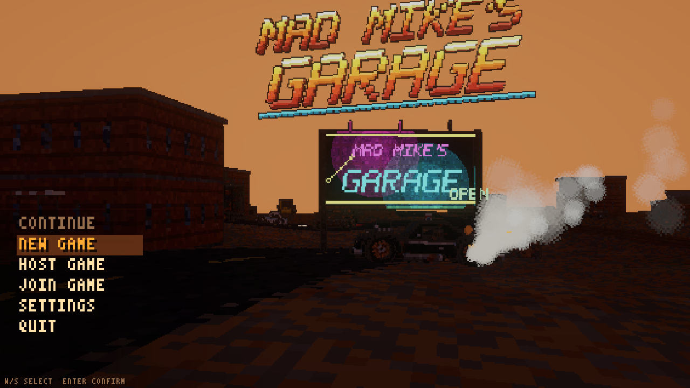

---

## Why you'll want to hack on it

- **Everything is voxels, everything is code.** Vehicles, parts, buildings, furniture, even the logo are authored in C# as voxel grids: no art pipeline to learn. Add a bumper in 20 lines.
- **Everything is destructible and craftable.** Carve through shacks with a sledgehammer, ram through walls with a spiked bumper, dig a quarry with an excavator, then smelt the ore and build it all back.
- **Systemic, not scripted.** Mud, rain, snow, ice, fire, temperature, power grids, water networks and tyre wear all interact.
- **Multiplayer built in.** Listen server, dedicated server and clients (Unity Transport, UDP).

---

## Features

### Vehicles you build from parts
Interceptor, Scavenger, Trabant, the Hauler war rig with a walk-in module, tankers, cargo and car-transport trailers (single and double deck with a tilting upper deck), plus a fleet of construction machines. Wheels, engines, radiators, bumpers, rams, spikes, armour plates, winches, cranes and turrets are **parts that fit any vehicle**. Crashes dent panels, bend frames and knock parts off; tyres wear, overheat and blow out.

| | |
|---|---|
| 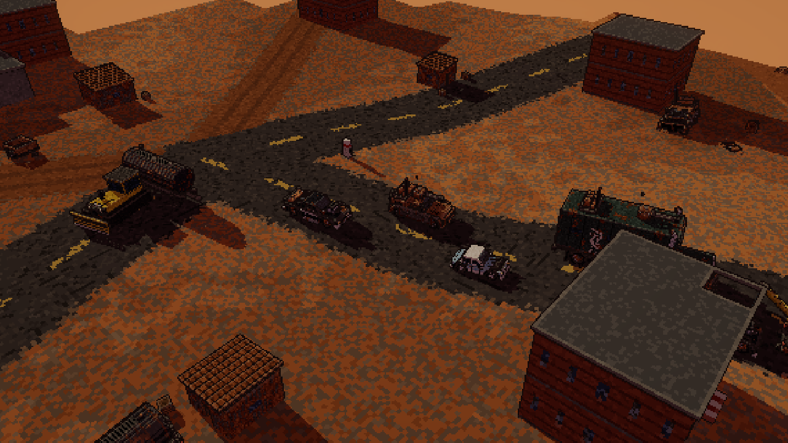 | 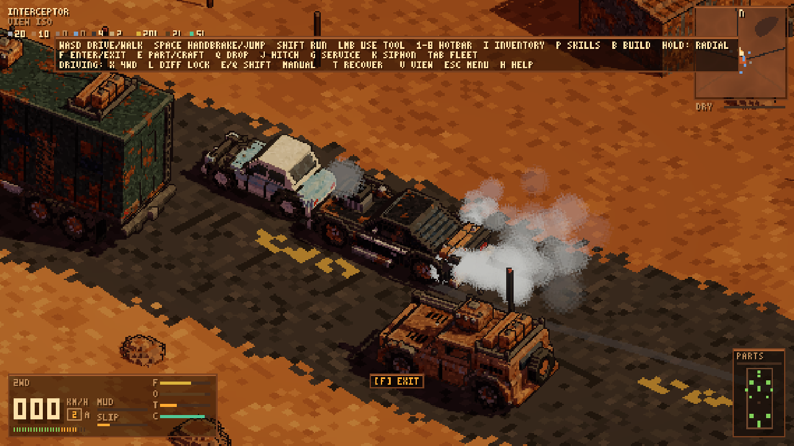 |
| 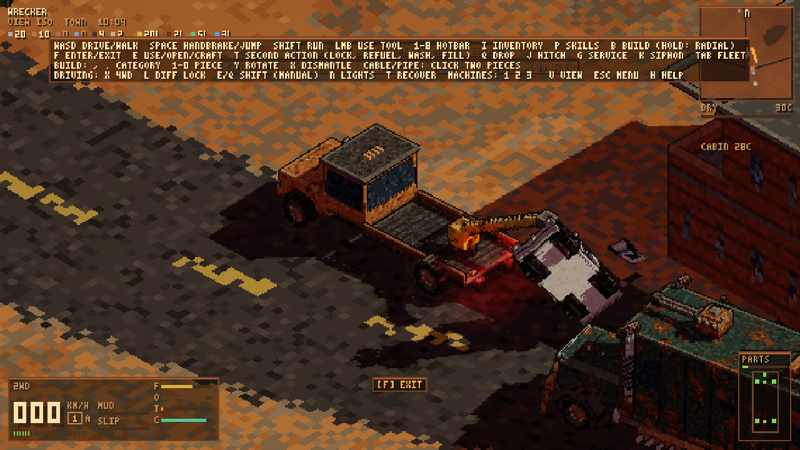 | 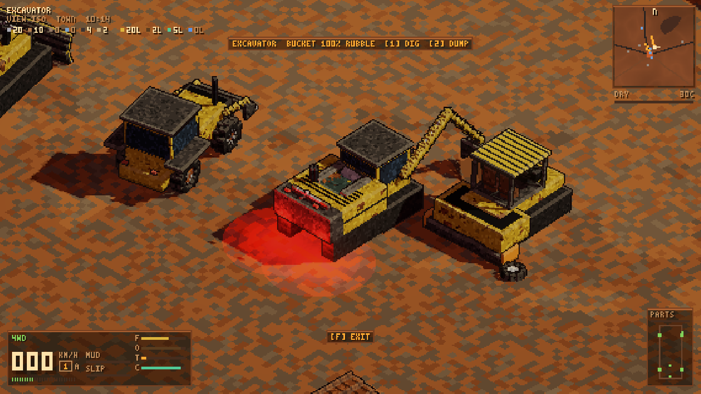 |

- Raycast suspension, open or locked differentials, switchable 4WD, auto or manual gearbox
- Fuel, oil, coolant, heat and faults per vehicle; refuel from a jerry can or at an old pump with a hose
- Headlights, tail and brake lights, cabin heating and air-con
- **Winch** (hook trees, rocks, buildings or other vehicles and pull yourself free) and **crane** (lift cars and wrecks)
- **Machines:** excavator, backhoe loader, bulldozer, dump truck, asphalt/concrete paver and roller that terraform and pave the world for real

### A big, varied wasteland
Deterministic procedural world: deserts, forests, tropical lakes, radioactive zones, and villages, towns and ruined cities connected by highways.

| | |
|---|---|
| 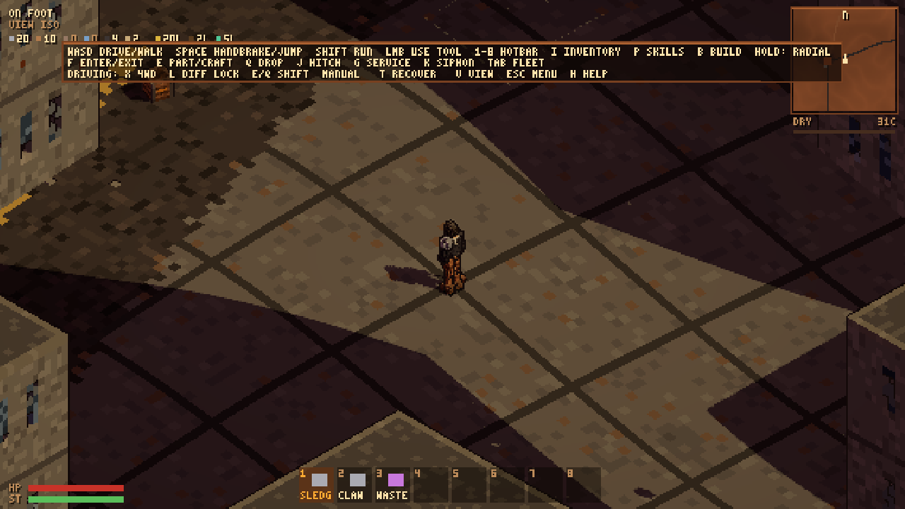 | 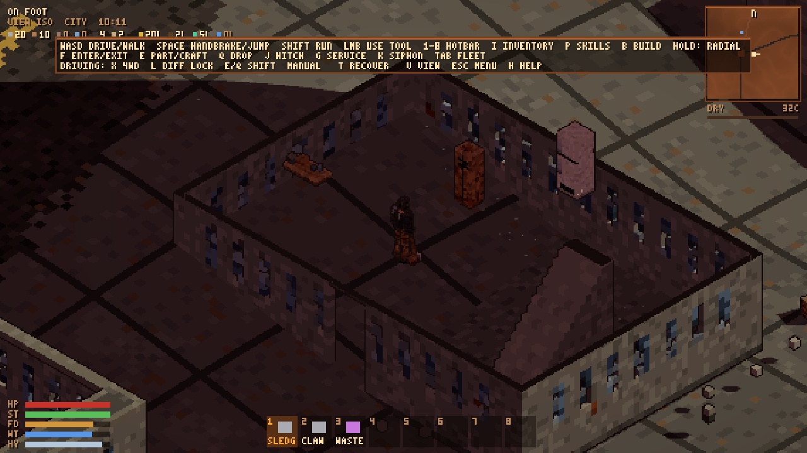 |
| 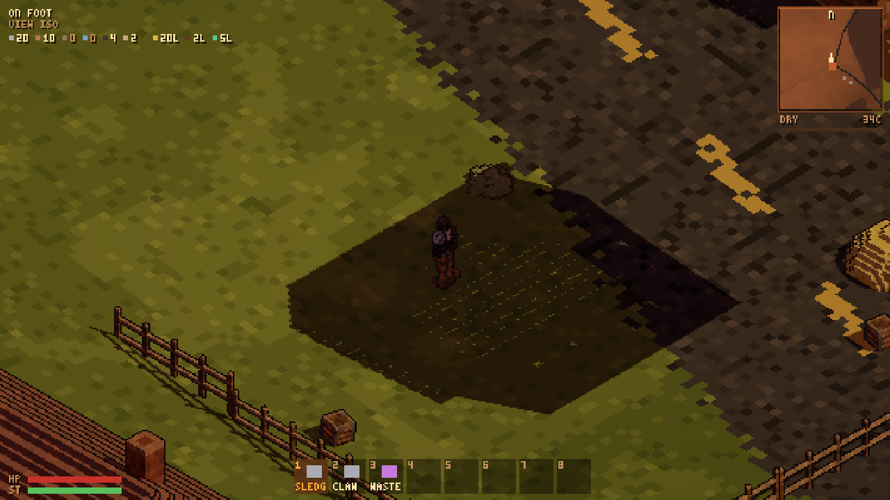 | 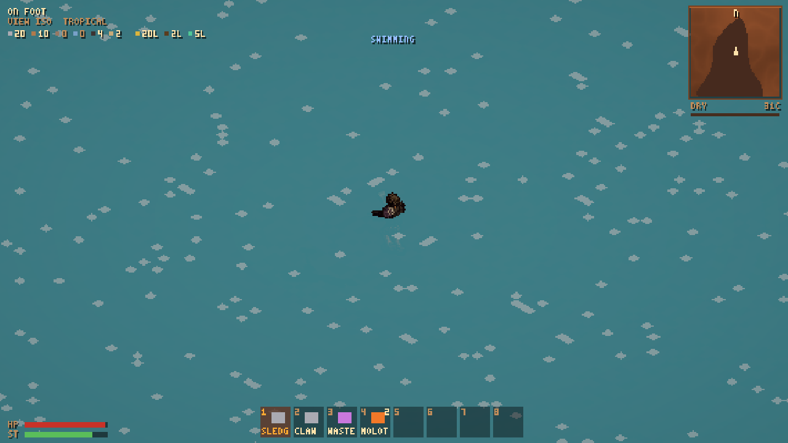 |

- Walkable multi-storey buildings with stairs and a see-through cutaway; shops, houses and garages full of lootable furniture
- Day and night with street, house and vehicle lights
- Weather: rain soaks the ground into mud, lakes rise; snow settles on the ground and dusts objects; freezing ground turns icy
- Fire spreads through dry forests and wooden buildings; molotovs; smoke drifts with the wind
- Line of sight: you only see what your character can actually see

| | |
|---|---|
| 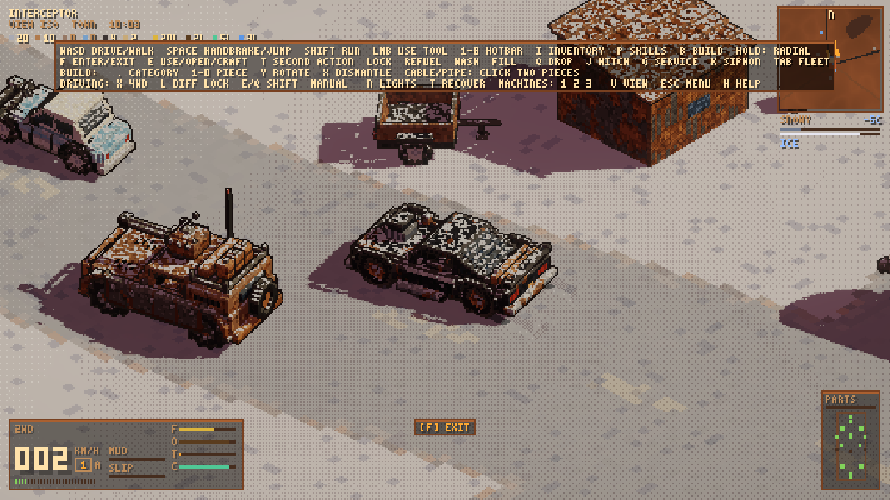 | 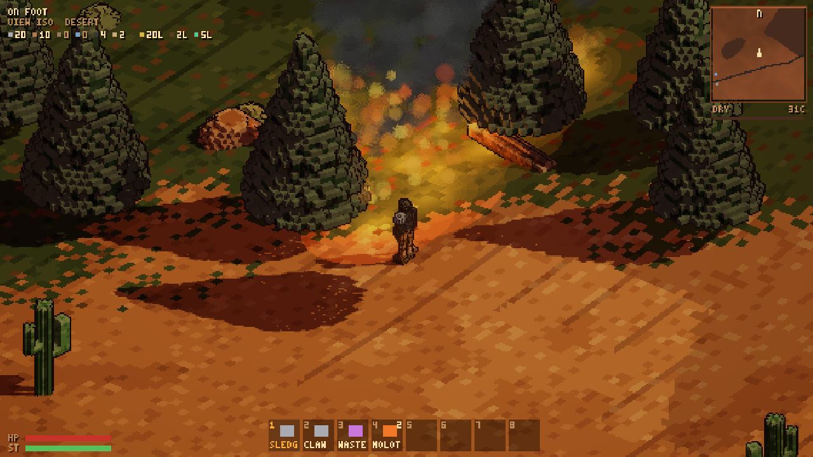 |

### Base building, farming, industry
- Walls (wood, brick, concrete), doorways, lockable doors, stairs, ladders, roofs, fences, furniture and decor, all placed with a claw hammer
- **Power:** generators, wind turbines, battery banks, cables, lights, fridges, ovens, electric heaters and air-con
- **Water:** rain collectors, pumps, filters, tanks, pipes, sinks, showers, sprinklers
- **Farming:** plots and planters, 11 crops, fruit trees, fertiliser, seasons
- **Industry:** dig biome soils, wash them into ores, smelt iron, copper, bronze and aluminium, burn charcoal, mix concrete and asphalt, distil biofuel, build whole vehicles in a garage. **Everything in the game can be crafted or found.**

| | |
|---|---|
| 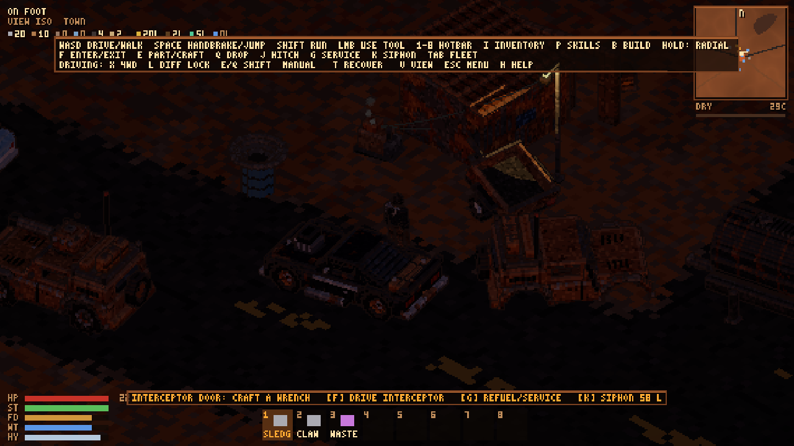 | 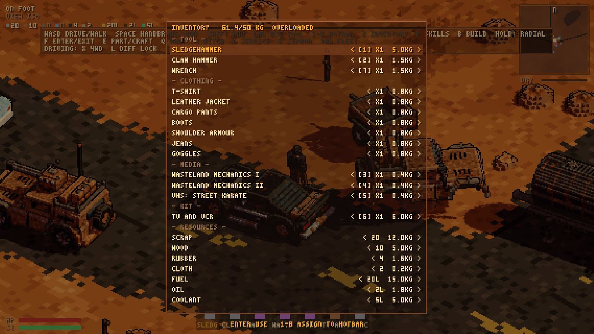 |

### Survive as a character, not a health bar
- Character creation with attributes and traits; skills improve by doing, from books and VHS tapes (play them on a TV you built), and through research
- Hunger, thirst, hygiene, food spoilage, sickness
- Body temperature: clothing layers stack warmth or cooling; shelter, heaters, fires and wet clothes matter; hypothermia and heatstroke
- Injuries per body part (scratches, lacerations, deep wounds, fractures, burns) with bleeding, infection, bandages, splints and disinfectant

| | |
|---|---|
| 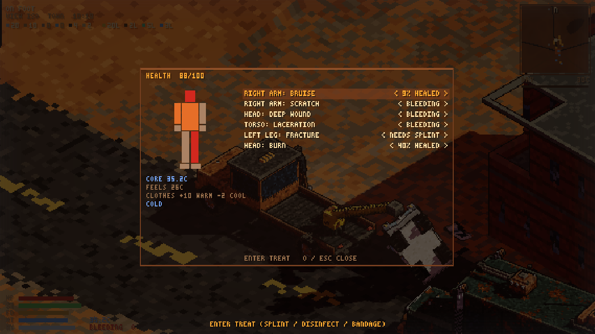 | 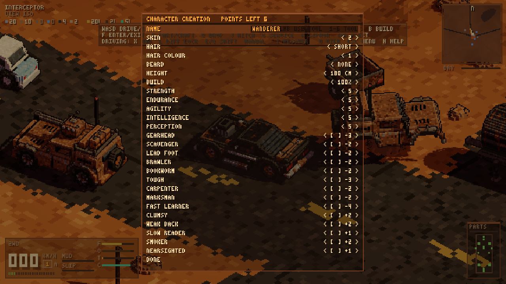 |

### Sound and radio
Every vehicle has a radio, and you can build radio sets for your base. **Eleven stations** broadcast around the clock: hard rock, classic rock, punk, southern rock, wasteland pop, synthpop, synthwave, darksynth, industrial and acid techno (about 250 original tracks), plus **WasteTalk FM 90.1**, with Big Hank & Dolly's morning show, the Wrench Line call-in, the Wasteland Wire news, weather that matches the actual sky, and late-night radio. DJs, jingles and commercials for wasteland businesses round it out. Engines rev with the rpm, tyres squeal, crashes crunch, and rain, wind and fire fill in the world.

### Looks
Everything renders through a low-resolution pixel-art camera with banded lighting and 1 px outlines. Switch to **vector mode** for full-resolution voxels, toggle ordered dithering, and scale light detail.

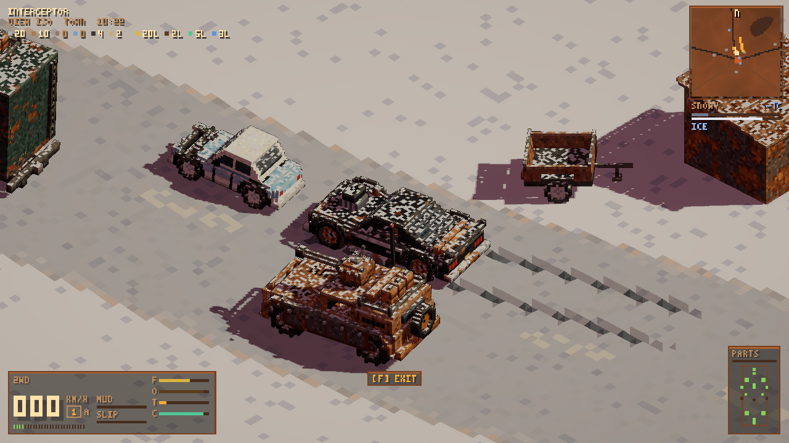

---

## Getting started

1. Install **Unity 6000.6** with URP.
2. Clone this repository and open the folder in Unity Hub.
3. Menu **MadMax → Build Game Scene** (generates meshes, part and vehicle prefabs, and the scene under `Assets/MadMax/Generated` and `Assets/MadMax/Scenes`).
4. Open `Assets/MadMax/Scenes/Wasteland_Game.unity` and press Play.

Dedicated server: **MadMax → Build Linux Player**, then
`MadMikesGarage.x86_64 -batchmode -nographics -server -port 7777`.

### Controls (short version)
`WASD` drive/walk · `F` enter/exit · `E` use/open/craft · `T` second action · `1-8` hotbar · `I` inventory · `P` skills · `O` health · `B` build (hold for radial menu) · `N` lights · `K` climate · machines `1 2 3` · winch `4 5 6` · crane `7 8 9 0` · `V` camera view · `M` radio (`,` `.` tune, `[` `]` volume) · hold `Tab` action wheel · `H` full help.

---

## Contributing

We would love your help. Good places to start:

| Area | Where | Ideas |
|---|---|---|
| New vehicle parts | `Assets/MadMax/Runtime/Designs/PartLibrary.cs` | bumpers, exhausts, roof racks, armour, engines |
| New vehicles | `Designs/VehicleDesigns.cs`, `MachineDesigns.cs`, `TransportDesigns.cs` | buggies, bikes, buses, a proper tracked tank |
| Buildings & furniture | `Building/BuildPieces.cs`, `FurnitureLibrary.cs` | new walls, decor, workshop stations |
| World props & biomes | `World/BiomeProps.cs`, `WorldGen.cs` | new settlement types, landmarks, regional weather |
| Recipes, food, crops | `Items/Recipes.cs`, `Items/FoodLibrary.cs` | cooking, medicine, new crops |
| Systems | `Game/`, `Vehicle/`, `World/` | NPCs, trading, missions, sound |

**Ground rules:**
- 1 voxel = 8 cm; colours come from the `Pal` palette ramps; call `Bevel()` once after painting.
- Parts are vehicle-agnostic and authored for the right side; sockets mirror them.
- World generation is deterministic from the seed (`System.Random`, never `UnityEngine.Random`).
- New persistent state goes into `SaveData` and both the save and the restore path; gameplay events that others must see go through `NetSession.Send*`.
- Enter Play Mode skips domain reload: reset every static in a `[RuntimeInitializeOnLoadMethod(SubsystemRegistration)]` method.
- Keep `FixedUpdate` and per-cell loops allocation-free.

Open a pull request with a screenshot of what you added. Bug reports with a save file and steps to reproduce are gold.

### Roadmap / open ideas
- Regional weather (more rain in the tropics, sandstorms in the desert)
- NPC survivors, traders and raiders
- Vehicle paint shop and decals

---

## Credits
- Sound effects: CC0, via the Lots of Sounds free API (see `Assets/MadMax/Resources/Sfx/CREDITS.txt`).
- Radio music generated locally with ACE-Step 1.5 (MIT); radio voices synthesised with F5-TTS from public-domain LibriVox recordings. Note: the F5-TTS pretrained weights are CC BY-NC 4.0, so the voice tracks are fine for a free/open project but must be re-voiced (another TTS or real actors) before any commercial release.

## Licence
Not chosen yet; the maintainers will add one. Until then, please ask before redistributing.
